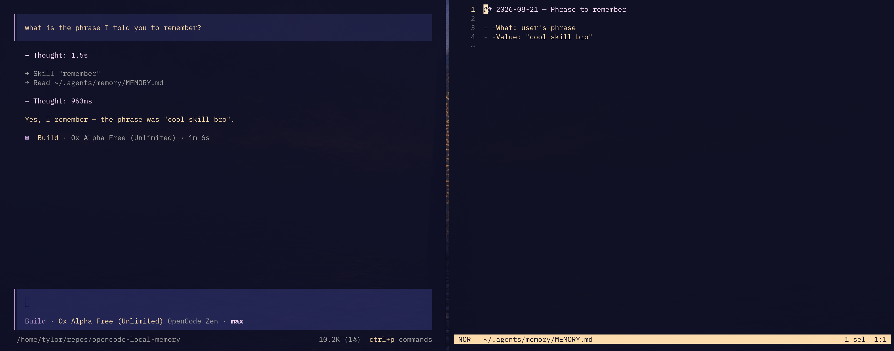

<p align="center">
  
</p>

---
# Opencode Local Memory

I created this local memory skill because I didn't want to be tied
to another cloud based subscription model, and this works *good enough*

Please feel free to tweak this, rip it apart, do whatever to it.

## Installation

`git clone` this repo and then `cd` into it.
Then simply run
```bash
  ./install.sh
```
If you want to make it to where opencode doesn't ask you for permission every
single time it commits something to memory, then make sure to add
`"~/.agents/memory/**": "allow"` to your `opencode.json` config under the
permission section.

## DISCLAIMERS

I found these to work well with some of the free models (Ox Alpha Free in particular)
but for other like Nemotron, it was way worse at adhering to the skill.

I wanted to implement something light that people could for the most part just drop
into their environment and have something work for them if they didn't want to pay for
a more premium option. The memory plugin offered on the opencode docs is fine, im sure,
I just didn't want to pay for it!

If this becomes useful enough I might make a true TypeScript custom tool for it. Otherwise,
This skill is 'as is' for now.
